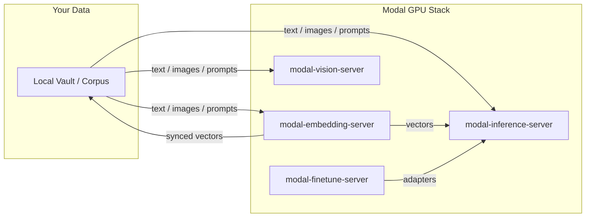

# Modal Vision Server

[](https://www.python.org/)
[](LICENSE)
[](https://github.com/sponsors/kylebrodeur)

High-performance GPU-accelerated computer vision system deployed on Modal. This is a generic vision inference service: you pick the main model, you pick the segmenter, you pick the fast gate. The shipped example card is a BioCLIP + plant stack for biological taxon classification and precision specimen segmentation, but any encoder, segmenter, and gate combination that follows the contract works.

## The Vision Pillars

### Classification
Driven by the main model chosen by the active card (the shipped default is a ViT-L/14 open_clip model trained on TreeOfLife-200M).
- **Class Precision:** Zero-shot text classification when the model has a text encoder, with a prompt template supplied by the card.
- **Few-Shot Matching:** Calibrated reference matching that allows for high-precision discrimination within confusable morphological clusters without steamrolling decisive text evidence. For image-only encoders, references are the classification contract: pass them per label at request time.

### Segmentation
The segmenter is a card choice; the shipped default is `facebook/sam2.1-hiera-tiny` (SAM 2.1). A card with `segmenter_kind: none` runs classify-only.
- **Adaptive Masking:** The card's fast gate decides if a specimen is isolated enough to skip segmentation. SAM is invoked only as a tie-breaker for ambiguous cases.
- **Specimen Isolation:** Hard sanity gates prevent background texture (e.g., flooring) from being classified as the primary specimen.

### Sync
Optimized for cold-start latency and resource persistence.
- **Weight Persistence:** Uses `modal.Volume` to store model weights, eliminating redundant Hugging Face downloads.
- **Kernel Warming:** Performs a dummy encode pass during initialization to pre-compile CUDA kernels, ensuring the first request hits peak performance.

## The Three Choices

The whole service is configured by three independent choices. Set them once in a model card (see [`registry/`](registry/)), or one at a time with single-line envs.

| Choice | Legal values | What it decides |
| :--- | :--- | :--- |
| Main model | `open_clip` or `transformers` backend, any Hugging Face model id | Which encoder classifies, and whether text prompts are available |
| Segmenter | `sam2` or `none` | Whether specimens are isolated before classification |
| Fast gate | `self`, `deterministic`, `external`, or `none` | What decides (if anything) that segmentation can be skipped on adaptive requests |

## Encoder, Segmenter, and Gate Quick Reference

### Backends
- `open_clip`: CLIP-style text + image encoders. Required for zero-shot classification from labels.
- `transformers`: the plain transformers vision pipeline. Use for image-only encoders (DINOv2 and friends); classification then runs on references only.

### Segmenters
- `sam2`: SAM 2.1 with the card's checkpoint. Use when photos may contain the subject among clutter.
- `none`: no segmentation stage. Use for clean inputs, classification-only deployments, or CPU runs.

### Fast gates
- `self`: the main model classifies the full image first; confident results skip SAM. Zero extra moving parts, one extra encode per request at worst.
- `deterministic`: a local script or rule set (`fast_gate_script`) with no model call. Use when the skip decision is pure input metadata or file characteristics.
- `external`: an HTTP endpoint (`fast_gate_url`) returns the skip decision. Use when a separate service owns the policy.
- `none`: no gate; adaptive requests always run the full path. Use for image-only models or when correctness outweighs latency everywhere.

## Sample Cards

Two cards ship in [`registry/`](registry/) as loadable examples and copy targets:

- [`registry/bioclip-plants.json`](registry/bioclip-plants.json): plants, adaptive, the deployment default. BioCLIP 2 via open_clip over 16 houseplant taxa, SAM 2 segmentation, and the `self` fast gate. Loading this card is byte-identical to the shipped defaults.
- [`registry/dinov2-objects.json`](registry/dinov2-objects.json): image-only, CPU-eligible. DINOv2 via transformers, no segmenter, no fast gate; classification requires `references` per label at request time and labels come from the request.

For the mechanics under the choices (request path, gate semantics, reference matching, caching), read [docs/HOW-IT-WORKS.md](docs/HOW-IT-WORKS.md).

## Deployment

### Deploy to Modal
To deploy this server to your Modal account:

```bash
modal deploy server/app.py
```

### Environment Configuration

Configuration resolves in this order, first hit wins per choice:

1. `MODAL_VISION_MODEL_CARD`: a card name from [`registry/`](registry/) (for example `bioclip-plants`) or a path to a card JSON file. Sets all three choices at once.
2. Single-line envs: `MODAL_VISION_MAIN_MODEL`, `MODAL_VISION_SEGMENTER`, `MODAL_VISION_FAST_GATE`.
3. Legacy envs, still respected when nothing above them is set: `MODAL_VISION_MODEL`, `MODAL_VISION_ADAPTIVE_SEGMENT`, and their friends below.
4. Built-in defaults, which are exactly the shipped `bioclip-plants` values.

| Variable | Default | Description |
| :--- | :--- | :--- |
| `MODAL_VISION_MODEL_CARD` | unset (built-in defaults) | Model card: registry name or path to a card JSON; sets main model, segmenter, and fast gate together |
| `MODAL_VISION_MAIN_MODEL` | unset (card or default) | Single-line override for just the main model |
| `MODAL_VISION_SEGMENTER` | unset (card or default) | Single-line override for just the segmenter (`sam2`, `none`) |
| `MODAL_VISION_FAST_GATE` | unset (card or default) | Single-line override for just the fast gate (`self`, `deterministic`, `external`, `none`) |
| `MODAL_VISION_GPU` | `T4` | GPU hardware target (T4, A10G, etc.) |
| `MODAL_VISION_MODEL` | `hf-hub:imageomics/bioclip-2` | Vision model identifier (legacy, still respected) |
| `MODAL_VISION_ADAPTIVE_SEGMENT` | `false` | Enable adaptive SAM segmentation (legacy, still respected) |
| `MODAL_VISION_REFERENCE_SCALE` | `60` | Cosine scale for reference matching (legacy, still respected) |
| `MODAL_VISION_RATE_LIMIT_MAX` | `30` | Maximum requests per window |

## Metrics (opt-in)

Set `MODAL_VISION_METRICS=1` to push request and gate telemetry into your own
VictoriaMetrics (or InfluxDB; same line protocol) via the vendored
`server/vm_metrics.py` (stdlib-only, never raises). `MODAL_VISION_VM_URL`
picks the endpoint (default `http://localhost:8428`);
`MODAL_VISION_DEVICE_TAG` labels each point's `device` tag (fallback: the app
name).

Emissions: `vision_request` (tags `segment_requested`, `gate`),
`vision_gate_decision` (tags `decision` = `skip` | `segment` | `undecided` |
`full`, `kind` = gate kind), `vision_identify_seconds` (tag `segmented`). The
`vision_gate_decision` series shows the skip rate broken down by gate kind.
With the env off, the identify path is byte-for-byte unchanged.

## The `/v1/identify` Contract

Request shape (unchanged by the card system):

```json
{
  "images": ["https://example.com/photo.jpg"],
  "segment": true,
  "candidates": ["Monstera deliciosa", "Monstera adansonii"],
  "references": {"Monstera deliciosa": ["https://example.com/ref1.jpg"]},
  "adaptive": true
}
```

- `images`: one or more image URLs. Required.
- `segment`: run the segmenter before classification. Ignored when the card's segmenter is `none`.
- `candidates`: label list. Falls back to the card's `label_defaults` when omitted.
- `references`: few-shot reference image URLs per label. Required for classification when the card's backend has no text encoder.
- `adaptive`: honor the card's fast-gate choice; decisive fast results skip segmentation.

Response shape:

```json
{
  "version": "2.0.0",
  "model": "hf-hub:imageomics/bioclip-2",
  "predictions": [{"score": 0.91, "name": "Monstera deliciosa", "reference_score": 0.87}],
  "reference_scores": {"Monstera deliciosa": 0.87},
  "segmented": true,
  "adaptive_skip": false
}
```

## Adaptive Behavior

With `adaptive: true` on the request, the card's fast gate may answer before the full segmented pass:

- `self`: the main model encodes the full image once. If the top prediction clears the card's `fast_gate_confidence` and the top-vs-second gap clears `fast_gate_margin`, the response returns immediately with `adaptive_skip: true` and `segmented: false`. Otherwise the request falls through to the segmented path, so a wrong fast answer is never traded for a slow correct one.
- `deterministic`: `fast_gate_script` makes the skip decision without any model call.
- `external`: the service at `fast_gate_url` makes the skip decision.
- `none`: every request runs the full path; `adaptive_skip` is always `false`.

The confidence and margin thresholds live in the card, so tuning the gate is a card edit, not a code change.

## Examples

See [`examples/`](examples/) for a minimal, stdlib-only client (`classify_example.py`) you can copy directly into your own stack.

## Contributing

See [CONTRIBUTING.md](CONTRIBUTING.md) for ground rules and workflow.

---

---

Built by [Kyle Brodeur](https://kylebrodeur.com) · Model-selection deep-dive: [Choose the Right Embedding Model for Your Data](https://kylebrodeur.substack.com/p/choose-embedding-model-for-your-data)

## Part of the Modal Toolkit

Five standalone Modal utilities from the same author, each extractable and deployable on its own.

- **[modal-embedding-server](https://github.com/kylebrodeur/modal-embedding-server):** GPU-backed embeddings with a monotonic sync protocol for private-first search.
- **[modal-inference-server](https://github.com/kylebrodeur/modal-inference-server):** OpenAI-compatible LLM inference with hot-set routing and scale-to-zero.
- **[modal-vision-server](https://github.com/kylebrodeur/modal-vision-server):** Generic vision classification: pick your model (open_clip or transformers weights), your segmenter (SAM 2.1 or none), and your fast gate (self, cheap CLIP, deterministic script, or external endpoint). The BioCLIP plant stack ships as the example card.
- **[modal-finetune-server](https://github.com/kylebrodeur/modal-finetune-server):** Profile-driven LoRA fine-tune and GGUF pipeline with an honest eval gate.
- **[modal-toolkit](https://github.com/kylebrodeur/modal-toolkit):** One operator CLI (`mtk`) that runs the fleet: `doctor`, `warm --all`, `shutdown --all`, `cost`, `flow`.
- **[embed-eval-on-your-vault](https://github.com/kylebrodeur/embed-eval-on-your-vault):** the eval-first pattern (benchmark embedding models on your own data before you deploy) as a single-file, zero-dependency harness.

## Ecosystem Flowchart




## Built on Modal

These packages run on [Modal](https://modal.com), the serverless GPU platform. If you build something with them, share it in the [Modal Slack](https://modal.com/slack) community (`#show-and-tell`). Issues and PRs welcome here on GitHub.

## License

Apache-2.0: see [LICENSE](LICENSE).
